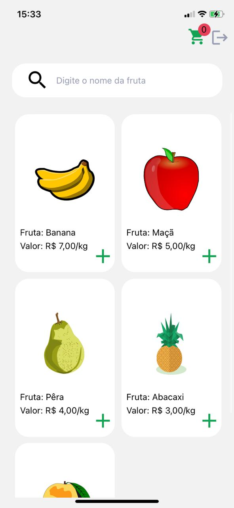
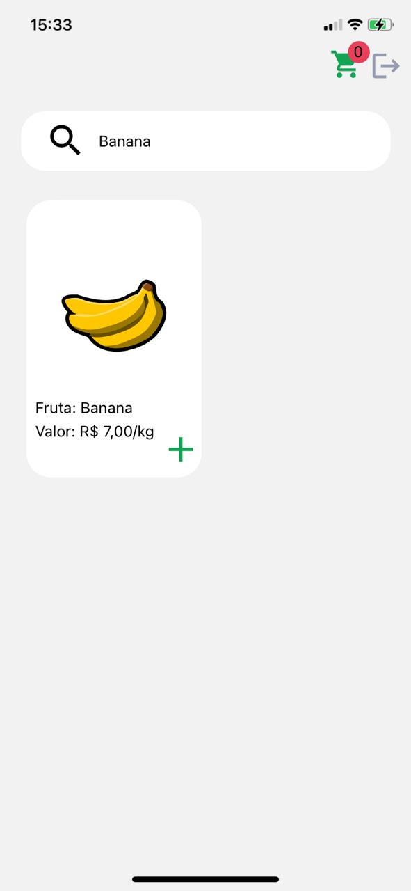
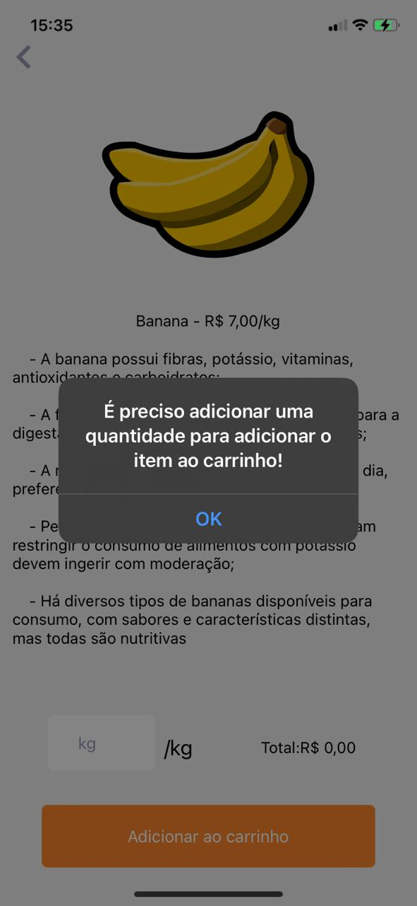
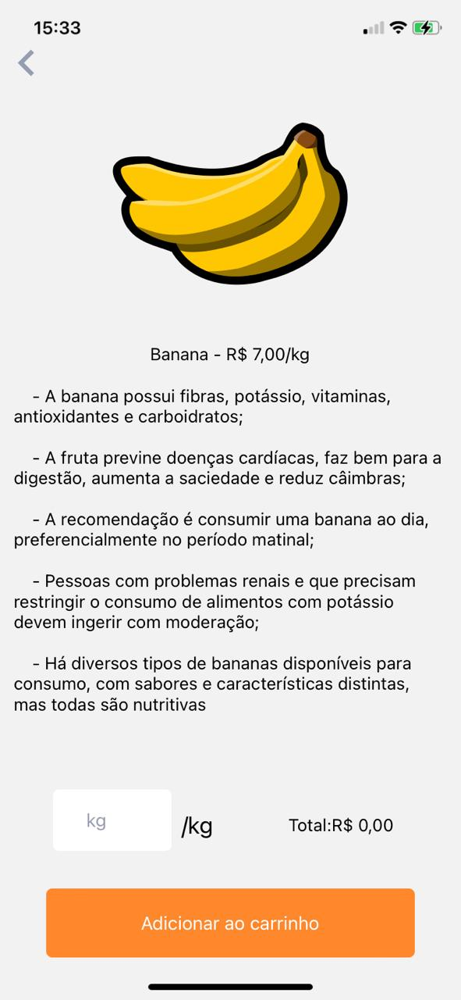
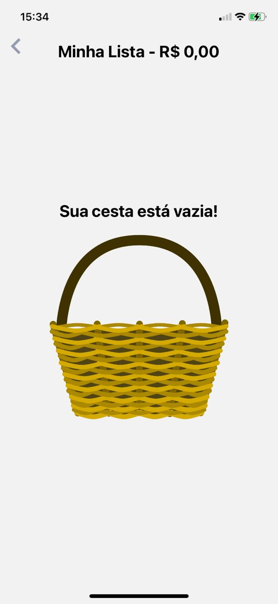
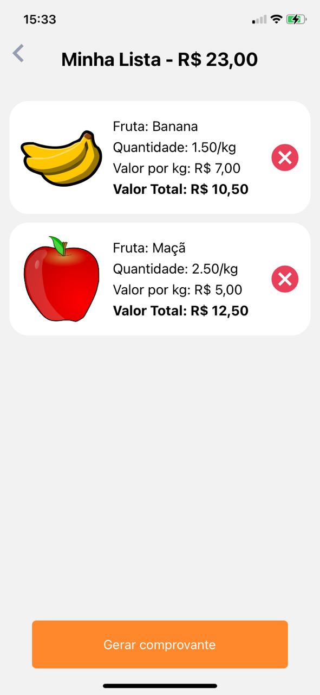
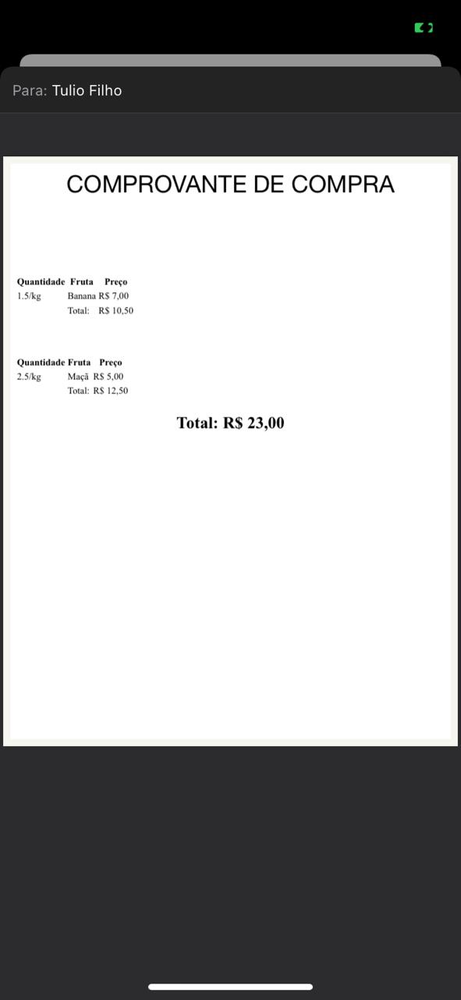

 <h1 align="Left">  
  <Strong>🥭 Basket of Fruits - React Native</Strong>
 </h1>

<p align="center">
  
  
  
  
  
  
  
  
</p>

---

## 🔎 Índice

- [🔎 Índice](#-índice)
- [🍎 Sobre](#-sobre)
- [💻 Tecnologias utilizadas](#-tecnologias-utilizadas)
- [🧱 Estrutura do projeto](#-estrutura-do-projeto)
- [📁 Como baixar o projeto e executar](#-como-baixar-o-projeto-e-executar)
- [🔭 Observações](#-observações)

---

## 🍎 Sobre

App de compras de frutas online.O app possui login e autenticação, listagem e filtragem de frutas. O usuários pode utilizar
quantidades inteiras ou fracionadas com base em kilogramas de cada fruta. O app disponibiliza as informações dos itens adiconados no carrinho e no final o usuário pode gerar um comprovante em PDF e ainda compartilhar o mesmo com todos os detalhes da cesta de frutas.

---

## 💻 Tecnologias utilizadas

O projeto foi desenvolvido utilizando as seguintes tecnologias:

- React Native CLI;
- TypeScript;
- Context API,
- React Native HTML To PDF;
- Formik;
- Yup;
- Styled Components;
- React Native Responsive Font Size;

---

## 🧱 Estrutura do projeto

`./android` -- Arquivos do ambiente Android;

`./ios` -- Arquivos do ambiente IOS;
z
`./src` -- Pasta principal do projeto;

`./src/assets` -- Arquivos de imagens e svgs;

`./src/components` -- Arquivos `.tsx e .ts` de componentes reutilizáveis;

`./src/contexts` -- Arquivos `.tsx` arquivo responsável por armazenar informação global que pode ser compartilhada em algum outro componente;

`./src/modules` -- Arquivos `.ts` com importações externas agrupadas;

`./src/routes` -- Arquivos `.tsx` com lógica e configuração de navegação;

`./src/scenes` -- Arquivos `.tsx` que descrevem componentes React que representam uma página acessável;

`./src/utils/formatted` -- Arquivos `.ts` com manipulação de valores;

`./src/utils/fruits` -- Arquivos `.ts` simulando uma api;

`./src/utils/templates` -- Arquivos `.ts` com estrutura do arquivo PDF;

`./src/utils/texts` -- Arquivos `.ts` com textos da aplicação;

`./src/utils/theme` -- Arquivos `.ts` com informações de colores;

`./src/utils/types` -- Arquivos `.d.ts` globais;

---

## 📁 Como baixar o projeto e executar

```bash
# Clonar o repositório
  $ git clone https://github.com/LuizTimboAlcantara/basket_of_fruits.git

# Entrar na pasta do projeto
  $ cd basket_of_fruits

# Instalar as dependências do projeto
  $ npm install ou yarn install

# Rodar a aplicação
  $ yarn ios ou yarn android

```

---

## 🔭 Observações

- Utilizar usuário: user@gmail.com e senha: @12345678 para logar no app;

- Versão do node v16.13.0;
